# Camera Calibration - Zhang's Method Theory and Implementation
Before the story unrolls, 5 coordinate systems should be understood such that we will know how an object in the 3d world is transformed into the 2d image plane eventually onto a discrete pixel plane step by step.

## 1. Pinhole Model

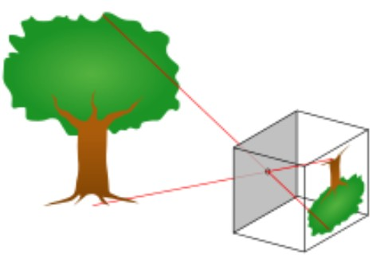
<h4>image1: pinhole</h4>     

 

### 1.1 From World to Camera Coordiantes
The first step for transfor transforming the 3d object onto pixel plane is converting the 3d object in the world to camera coordinates. In a metaphor, we should see the world or the object in camera's viewpoint. Mathamatically, a transformation of coordiantes is required. Therefore, rigid transformation is introduced as follows.

- Rigid transformation only includes rotation and translation, which are respectivly named as $R$ and $t$. Some other useful facts are:
    ([Click here to know the detailed properties of the orthogonal matrix](https://mathworld.wolfram.com/OrthogonalMatrix.html))
    - $R$ is orthogonal matrix whose vectors are all unit vectors such that $R^T = R^{-1}$ 
    - row $r_1, r_2, r_3$ are mutually perpendicular such that $r_i\cdot r_j = 0$ 
    - $r_i$ is an unit vector so that $|r_i| = |r_j| = 1$ such that $r_1^{T}r_1 = r_2^{T}r_2$

Mathamatically 
Given $X_c$ is the camera point. $X_w$ is the world point.

$$
\begin{equation}
    X_w = 
    \begin{bmatrix}
        x_w \\
        y_w \\
        z_w 
    \end{bmatrix}
    \quad\quad\quad    
    X_c =
    \begin{bmatrix}
    x_c \\
    y_c \\
    z_c  
    \end{bmatrix}
    \end{equation}
$$ 

In homogenous form as follows:

$$
\begin{align}
    \begin{bmatrix}
    x_c \\
    y_c \\
    z_c \\
    1
    \end{bmatrix}
    &= 
    \begin{bmatrix}
    r_{11} & r_{12} & r_{13} & t_1 \\
    r_{21} & r_{22} & r_{23} & t_2 \\
    r_{31} & r_{32} & r_{33} & t_3 \\
    0      & 0      & 0      & 1   
    \end{bmatrix}
    \begin{bmatrix}
    x_w  \\ 
    y_w  \\
    z_w  \\
    1
    \end{bmatrix} \\
    &= 
    \begin{bmatrix}
    R & t \\
    0^T & 1
    \end{bmatrix}
    \begin{bmatrix}
    x_w  \\ 
    y_w  \\
    z_w  \\
    1
    \end{bmatrix}
    \end{align}
$$

### 1.2 From Camera to Image Plane

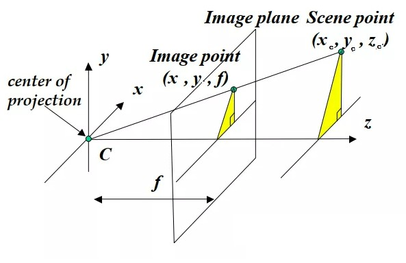     
<h4>image2: pinhole</h4>  

 
Different from the image1, image2 projects the object in front of the pinhole(center of the projection), which has a better visualization due to not having the triangular upside down.
  
Following the properties of similar triangles:

$$
\begin{equation}
    x = f \frac{x_c}{z_c} \quad\quad\quad\quad y = f \frac{y_c}{z_c}
\end{equation}
$$

Then write it into matrix form:
$$
\begin{align}  
\begin{bmatrix}
    x \\
    y \\
    1
\end{bmatrix}
&= 
\begin{bmatrix}
    f & 0 & 0 \\
    0 & f & 0 \\
    0 & 0 & 1 
\end{bmatrix}
\begin{bmatrix}
    \frac{x_c}{z_c} \\
    \frac{y_c}{z_c} \\
    1
\end{bmatrix} \\

&=
\frac{1}{z_c}
\begin{bmatrix}
    f & 0 & 0 \\
    0 & f & 0 \\
    0 & 0 & 1 
\end{bmatrix}
\begin{bmatrix}
    x_c \\
    y_c \\
    1
\end{bmatrix} \\
\end{align}  
$$

### 1.3 From Image Plane to Pixel Plane
We represent an image with discrete pixels. However the image plane represented with (x, y) is continous. So we also need to define a proper conversion for that. 
- $d_x$ and $d_y$ indicate the size of a pixel in the real world, let's say 5mm/pixel such that $f_x$ and $f_y$ has a unit of pixel.

$$
\begin{align}  
f_x = \frac{f}{d_x} \\
f_y = \frac{f}{d_y}
\end{align}  
$$

Note that the origin of the image plane is on center. But the pixel plane's is on the left top corner. Therefore, we also need to do the translation as follows:

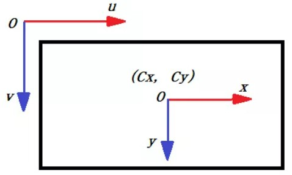 
<h4>image3: image_plane and pixel plane</h4>      

- $v$ and $u$ is the row_id and col_id of the image matrix

$$
\begin{align}
\begin{bmatrix}
    u \\
    v \\
    1
    \end{bmatrix}
    = 
\begin{bmatrix}
    \frac{1}{d_x} & 0             & c_x \\
    0             & \frac{1}{d_y} & c_y   \\
    0             & 0             & 1 
    \end{bmatrix}
\begin{bmatrix}
    x  \\ 
    y  \\
    1
    \end{bmatrix}
\end{align}
$$

Note that $c_x$ and $c_y$ are the offsets which ususally are $\frac {1}{2}$ of the image.

So far, we do a recap. From world to pixel plane, we connect the eq3, eq6, eq7, eq8 and eq9. We can represent the transformation as follows:

$$
\begin{align}
\begin{bmatrix}
        u \\
        v \\
        1
    \end{bmatrix}
    &= 
\frac{1}{z_c}
\begin{bmatrix}
        f_x           & \gamma             & c_x   & 0\\
        0             & f_y                & c_y   & 0\\
        0             & 0                  & 1     & 0
    \end{bmatrix}
\begin{bmatrix}
        R & t \\
        0^T & 1
    \end{bmatrix}
\begin{bmatrix}
        x         \\ 
        y         \\
        1
    \end{bmatrix} \\
    &=
    \frac{1}{z_c}
    K[R|t]
\begin{bmatrix}
        x_w  \\ 
        y_w  \\
        z_w  \\
        1
    \end{bmatrix} \\
\end{align}
$$

Note that
$$
K = \begin{bmatrix}
        f_x           & \gamma        & c_x   & 0 \\
        0             & f_y           & c_y   & 0 \\
        0             & 0             & 1     & 0
    \end{bmatrix}
$$

If you pay attention to the details, two new signs are added. 
-   you will find there is one more cofficients named $\gamma$ in camera matrix. $\gamma$ is the axis skew which is the angle of the x and y in image plane. For simplicity we set it 0 becuase usually $axis_x \perp axis_y$
- a $[0, 0, 0]^T$ is columned by the camera matrix. The modification is introduced considerting about the matrix multiplication of $K[3 \times 4] \times R|t[4 \times 4]$ 

-  [Refer to visualization of the axis skew](https://ksimek.github.io/2013/08/13/intrinsic/)
- $R|t$ : extrinscics parameter. Shape:[4x4]
- $K$ : intrinscis parameter
- $P$ : projective matrix ($P = K[R|t]$)
 

## 2. Distortion Model
Distortion types:
-   ref: 
    - https://ori.codes/artificial-intelligence/camera-calibration/camera-distortions/
    - https://mp.weixin.qq.com/s/MhG1tFhjlftOk_uwY66afQ

 

- Radial distortion
$$
x_{dist} = x + x(k_1r^2 + k_2r^4 + k_3r^6) \\
y_{dist} = y + y(k_1r^2 + k_2r^4 + k_3r^6) \\
r = x^2 + y^2
$$

- Tangential distortion
$$
x_{dist}  = x + 2p_1 x y + p_2 (r^2 + 2x^2) \\
y_{dist}  = y + 2p_2 x y + p_1 (r^2 + 2y^2) \\
$$

- Combine them together
$$
x_{dist} =  x + x(k_1r^2 + k_2r^4 + k_3r^6) +  2p_1 x y + p_2 (r^2 + 2x^2) \\
y_{dist} =  y + y(k_1r^2 + k_2r^4 + k_3r^6) +  2p_2 x y + p_1 (r^2 + 2y^2)
$$

$$
u = f_x x_{dist} + c_x \\
v = f_y y_{dist} + c_y
$$

## 3. Compute Homogeneous Matrix
- ref for details: [DLT part1](https://classroom.udacity.com/courses/ud810/lessons/3004768815/concepts/30084186810923)

- The lesson from the above link details the equations below.

    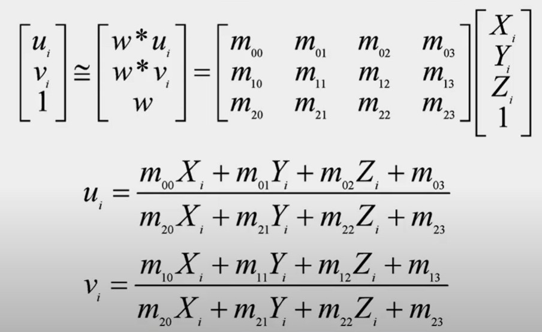
    <h4>image: H1</h4>

From the above equations, we see that one point offers a pair of equations. We have 3x4 parameters such that 12 equations should be offerd, which are 6 points.

Futher explanations, (x1, y1, z1) ----> u # the first eq; (x1, y1, z1) ----> v # the second eq

    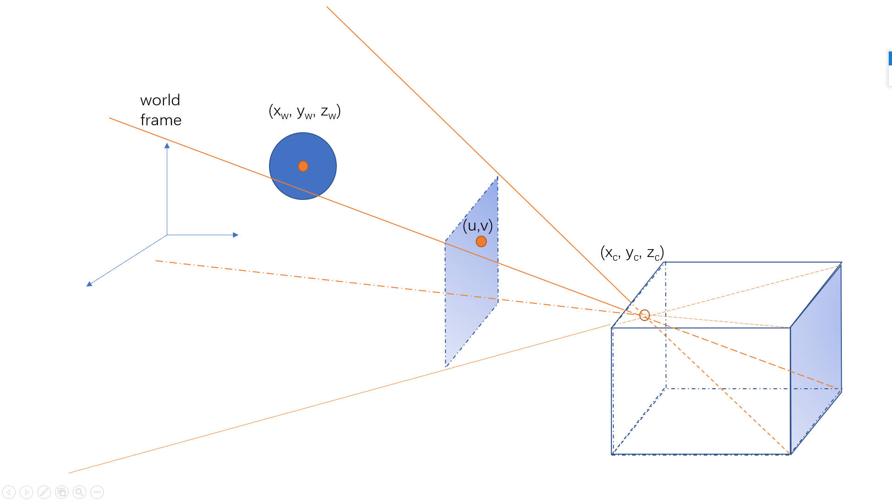

    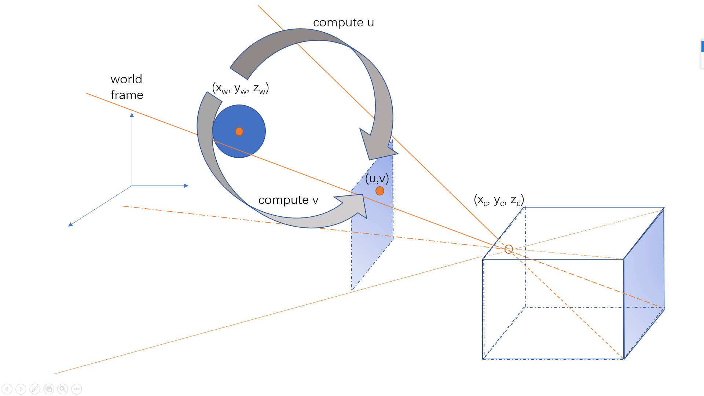

 
 

    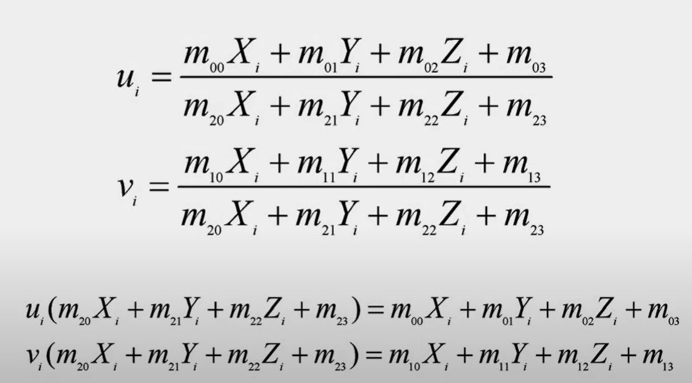
    <h4>image: H2</h4>

 
 

    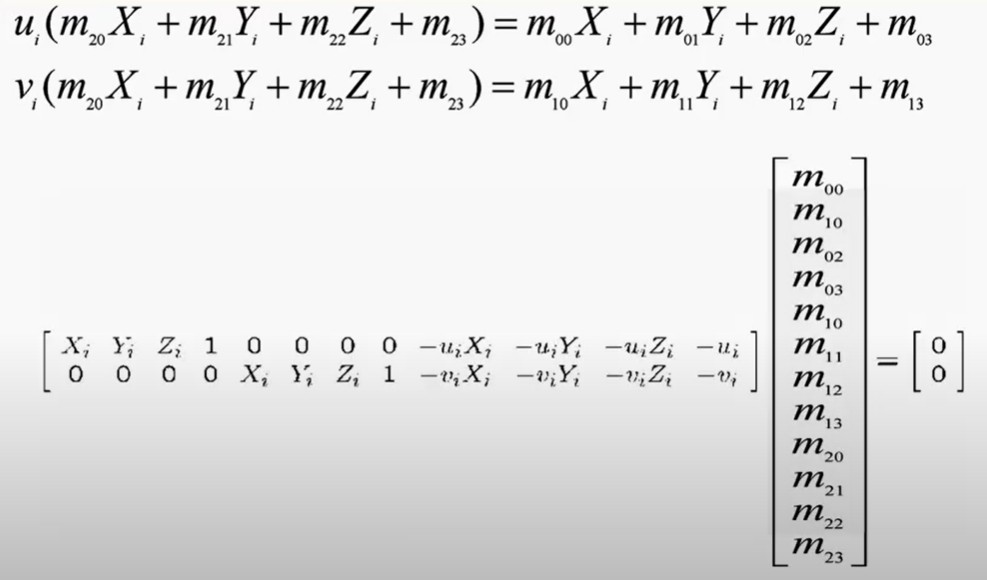
    <h4>image: H3</h4>

The reason we did all of these things is because matrix is a powerful tool to solve set of equations. Now stretch way back into your memory from linear algebra. We are usually solving $Ax=B$. If we have more equations than the unknown. We solve to a least square solution. But there is a particular type where the right side is all 0s, it is $Ax=0$ called a homogenous set of equations.
  
### 3.1 How to solve $Ax = 0$
ref for details: [DLT part2](https://classroom.udacity.com/courses/ud810/lessons/3004768815/concepts/30084186820923)

    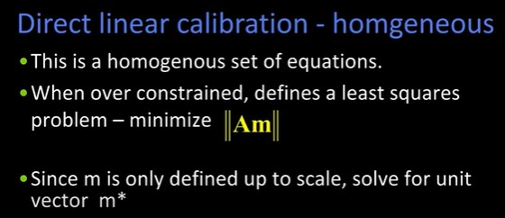
    <h4>image: DLT1</h4>

- Over constrained refers to we have more equations than the unknown.
- m is only valid up to scale meaning that if you look at image:H3, all the $m_{ij}$ can be divided by a scale, because the right side equals zeros. We end it up with a fact that we don't care how much the $m_{ij}$. So we can make it an unit vector. 
- So the question now is reduced to what unit vector $m$ minimizes the $Am$
   

#### 3.1.1 Solution 1:
- 

    
    <h4>image: solution of DLT</h4>

- ref for details [eigen vector and eigen value](https://www.youtube.com/watch?v=PFDu9oVAE-g)

   

#### 3.1.2 Solution 2 (SVD trick):
- 

    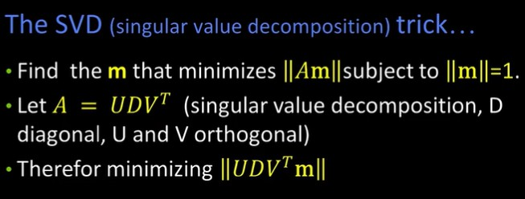
    <h4>image: SVD1</h4>

- 

    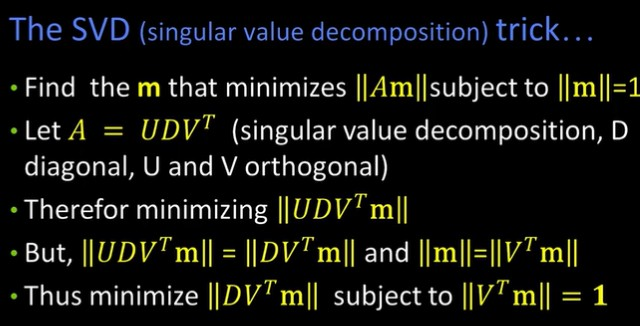
    <h4>image: SVD2</h4>

- the reason why $U$ can be get rid of, and $V^T$can be added is because $U$ and $V$ are both composed of unit vectors. It's known that a vector multiplied with an unit vector doesn't change its magnitude but only its orientation.
   

##### 3.1.2.1 Why did that substitution

    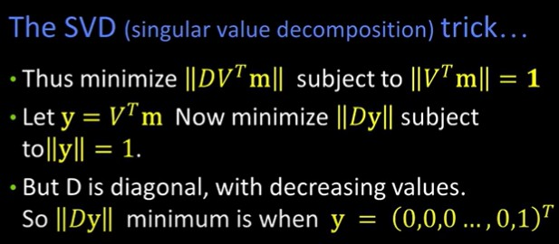
    <h4>image: SVD3</h4>

  

    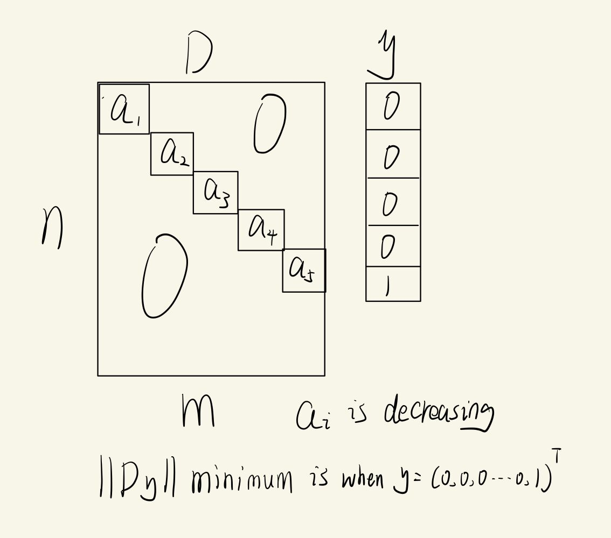
    <h4>image: Dy_min</h4>

  

    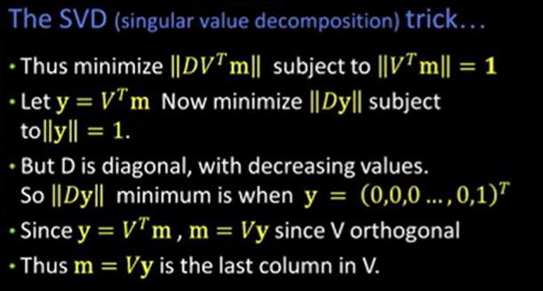
    <h4>image: SVD4</h4>

Just pull out the last column of $V$.

   
## Reference
- [Least-Squares Rigid Motion Using SVD](https://igl.ethz.ch/projects/ARAP/svd_rot.pdf)
    - given H and K, compute R and t
- [Compute_homography_Matrix](https://mp.weixin.qq.com/s?__biz=MzkzNzE2NTA2OQ==&mid=2247483694&idx=1&sn=b042f17f560771911a8c855fd190c4fc&chksm=c292e94cf5e5605a5e39a5c5f3f88634241eae510dd6e73a1f9f67f981d3e938d018636af07a&scene=21#wechat_redirect)
    - compute H
- [相机标定（张正友标定算法）解读与实战(从理论到手撕c++)](https://mp.weixin.qq.com/s/bjahmTT2aTPuiNYsR_CxuA)
    - good c++ code to run
- [Camera Calibration using Zhang's Method (Cyrill Stachniss)](https://www.youtube.com/watch?v=-9He7Nu3u8s)
    - detail zhang's method well
- [Direct Linear Transform for Camera Calibration and Localization (Cyrill Stachniss)](https://www.youtube.com/watch?v=3NcQbZu6xt8&t=1282s)
    - detail DLT
- [Zhengyou Zhang's paper](https://www.microsoft.com/en-us/research/wp-content/uploads/2016/02/tr98-71.pdf)
- [Udacity Calibrating Camera](https://classroom.udacity.com/courses/ud810/lessons/3004768815/concepts/30084186830923)
    - detail SVD trick to get the H.

